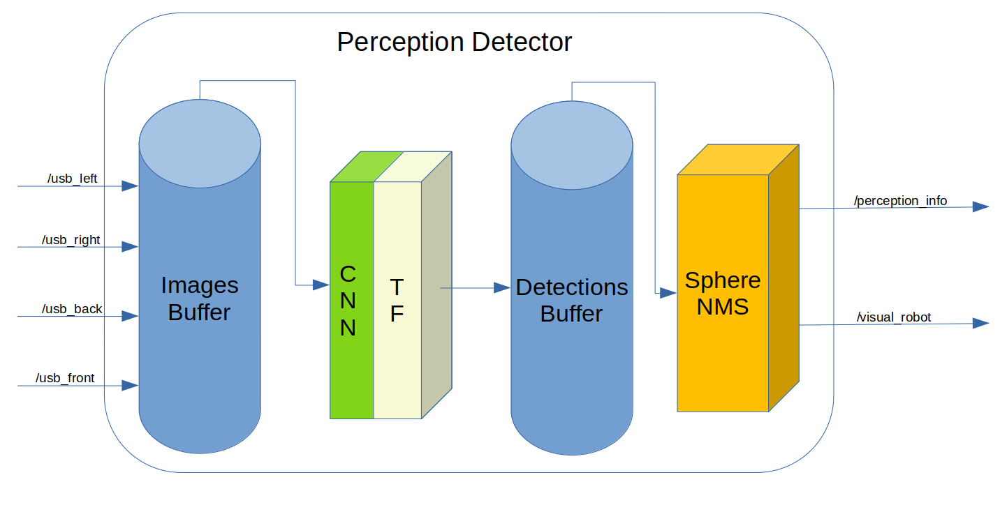

# TUP2023-Sentry-Perception
沈阳航空航天大学TUP战队2023年哨兵感知模块

## 作者：邸皓 顾昊

## 1. 简介
### 1.1综述
为补足工业相机视场角小，视野受限的问题，对敌方车辆检出范围受限的问题。我们设计了全向感知模块。该模块可以结合外接的USB摄像头与OAK深度摄像头对外界环境进行感知。
本分支为移除depthai话题需求后，只保留openvino对USB摄像头推理版本，方便进行二次开发。


注意：
**自瞄部分仍未完成整理，但该库需要使用其中包含的两个消息`Detection.msg`和`DetectionArray.msg`。目前我们暂时在`perception_detector/msg`文件夹中提供了两个消息的定义，使用时可自行修改CMakeLists编译.**
### 1.2.订阅话题与发布话题
#### 1.2.1 订阅话题
|话题|消息类型|描述|
|----|-----|----|
|**/usb_left**|sensor_msgs/Image|左侧USB相机图像Topic|
|**/usb_right**|sensor_msgs/Image|右侧USB相机图像Topic|
|**/usb_back**|sensor_msgs/Image|后侧USB相机图像Topic|
|**/color/yolov5**|depthai_ros_msgs/SpatialDetectionArray|OAK相机推理结果Topic|
#### 1.2.2 发布话题
|话题|消息类型|描述|
|----|-----|----|
|**/perception_info**|global_interface/DetectionArray|车辆感知结果Topic|
|**/visual_robot**|visualization_msgs/MarkerArray|车辆感知结果可视化Topic|

## 2. 项目结构
├── perception_detector  
│   ├── CMakeLists.txt //CMake文件  
│   ├── config  
│   │   └── config.yaml //相机参数配置文件  
│   ├── include  
│   │   ├── armor_detector  
│   │   │   └── armor_detector.hpp //装甲板检测头文件  
│   │   ├── detector_node.hpp //感知节点头文件  
│   │   └── inference  
│   │       └── inference_api2.hpp //CNN推理头文件  
│   ├── launch  
│   │   └── armor_detector.launch.py //launch文件  
│   ├── model: //存放CNN模型权重文件  
│   ├── package.xml //package描述文件  
│   └── src  
│       ├── armor_detector  
│       │   └── armor_detector.cpp //装甲板检测cpp文件  
│       ├── detector_node.cpp //感知节点cpp文件  
│       └── inference  
│           └── inference_api2.cpp //CNN推理头文件  
├── pic: //存放文档图片  
├── README.md  
└── usb_cam: //usb-cam库  

## 3.算法流程
算法示意图如下:

程序将订阅相关topic，接收USB相机采集的图像，为每个相机分配一个CNN推理实例，并进行CNN模板检测，搭载有板载推理芯片的OAK深度相机则会被分配到一个Adapter来对其推理结果转化。推理与转换完成后这些推理结果将会经历TF坐标变换，均被转化至统一的base_link系下并被存入buffer以供后处理。  

后处理函数将以20hz的频率被调用，后处理函数将从buffer中提取出一定时间范围内的装甲板检测信息，并对这些检测结果进行两层NMS处理。第一层NMS处理依据检测到装甲板间的三维距离进行，主要用于去除重复装甲板，并保存个装甲板实例的重叠同类别装甲板数;第二层NMS先按重叠同类别装甲板数对第一次结果进行排序，再次按类别进行NMS，确保无误识别与同类别车辆出现多次的情况。经过上述处理后我们已经得到了周围车辆的检测结果，这些信息会以检测结果与可视化消息的形式发布。


## 4.使用教程
### 4.1 配置usb_cam
打开`usb_cam/config`,在该文件夹下新建你自己的相机配置文件夹，并添加以下文件:
- `camera_info.yaml`: 相机内参
- `params.yaml`: 相机配置参数
### 4.2 配置perception_detector
打开`perception_detector/config/config.yaml`,为你的相机添加类似配置
```yaml
    usb_left: 
      image_topic: /usb_left/image_raw #相机topic
      frame_id: "usb_left_frame" #相机的frame_id，后续用来进行多相机NMS.
      camera_info_path: /home/tup/ros2_ws/src/TUP2023-Sentry-Framework/TUP2023-Sentry-Perception/usb_cam/config/usb_left/camera_info.yaml #相机内参文件路径
```
### 4.3 配置launch文件
在launch文件中为你的相机新增节点以启动相机


